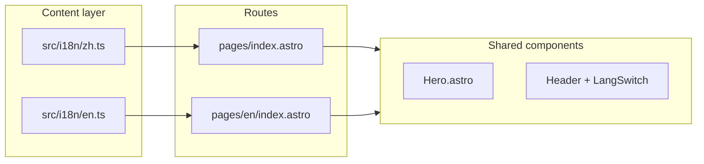

# Ellen Wang English Studio — v2 方案

> 视觉升级 + 中英双语 · 2026-06-10  
> 基于 v1.0.0 线上站：http://hk1.youyoubilly.com:8080

---

## 一、现状诊断

| 问题 | 根因 |
|------|------|
| 视觉偏「干」 | Hero/Contact 均为 EW 字母占位；全站无摄影图；Services 仅数字序号 |
| 雇主英文体验不完整 | `<html lang="zh-CN">`；除 `#employers` 外主体为中文；雇主从顶部滚动需读大量中文 |
| 已有优势 | 配色/排版已专业；Employers 区块英文质量可用；静态站性能好（Lighthouse perf 99） |

**结论：** 不需要大改 UI 框架，应在现有 Astro 组件上 **加图 + 拆双语内容**，风险可控。

---

## 二、视觉升级（图片）

### 2.1 原则（对齐 design-brief）

- 清爽、成熟、学术感 — **不要** 少儿机构插画、彩虹、夸张 Stock「假笑师生」
- 图片是 **点缀**，不抢 CTA；微信内仍要快（WebP、lazy、单页总量建议 < 500KB 新增）
- **Ellen 真人照** 仍是最终方案；Stock 仅作 **过渡**，并标注待替换

### 2.2 建议配图位置

| 区块 | 用途 | 风格关键词 | 规格 |
|------|------|------------|------|
| **Hero** | 半身专业照 | 浅背景、自然光、商务 casual | 3:4，≥800px |
| **Services ×3** | 卡片顶图（可选） | IELTS：一对一对话；Academic：图书馆/笔记；Business：会议桌 | 16:9 裁切，~600px 宽 |
| **Why Ellen** | 窄条背景或侧图 | 教室/白板/大学走廊（虚化） | 低对比 overlay |
| **Background** | 时间线旁小图 | 广州城市天际线（极淡）或纯 typography 不加图 | 可选 |
| **Contact** | 微信 QR + 可选环境图 | 汇景/天河办公感（极 subtle） | QR ≥430px |
| **OG 分享** | 微信转发卡片 | 左文右 Ellen 头像 | 1200×630 |

### 2.3 过渡 Stock 来源（免费商用）

优先 **Unsplash / Pexels**（无需署名，但仍记录来源便于替换）：

| 场景 | 搜索词示例 |
|------|------------|
| IELTS / 口语 | `student interview preparation`, `language study desk` |
| 学术英语 | `university library study`, `presentation classroom` |
| 商务英语 | `business meeting professional`, `office discussion` |
| 城市/地点 | `Guangzhou skyline minimal`, `modern office Guangzhou` |

**禁止：** 儿童卡通、培训机构 banner、带水印 Getty 预览图。

### 2.4 技术实现（Stage 8）

```
site/public/images/
  hero/ellen-portrait.webp          ← Ellen 真人（优先）
  hero/ellen-portrait-stock.webp    ← 过渡（可选）
  services/ielts.webp
  services/academic.webp
  services/business.webp
  og/og-share.jpg
```

- 新增 `Image.astro`：统一 `loading="lazy"`、`decoding="async"`、alt 文案
- `Hero.astro` / `Services.astro` 接入图片；保留 EW 占位为 fallback
- 更新 `website/assets/README.md` 清单

**验收：** 375px 首屏仍 < 3s；Lighthouse perf ≥ 90；E2E 截图对比。

---

## 三、多语言方案（中 + 英）

### 3.1 需求评估

| 受众 | 主语言 | 现状 | v2 目标 |
|------|--------|------|---------|
| 家长 / 雅思学生 | 中文 | ✅ | 保持 `/` 中文为主 |
| 国际学校 HR / 外教主管 | **英文** | ⚠️ 仅 Employers 英文 | **`/en/` 全英文页** |
| 双语家长 | 中+英 | Hero 有英文副标题 | 语言切换器 |

**推荐：路径级双语（非 JS 切换内容）**

| URL | 语言 | 说明 |
|-----|------|------|
| `http://hk1.youyoubilly.com:8080/` | 中文 | 默认，`lang=zh-CN` |
| `http://hk1.youyoubilly.com:8080/en/` | 英文 | 纯英文，`lang=en` |

理由：静态站零 JS、SEO/`hreflang` 清晰、雇主链接可直接发 `/en/`。

### 3.2 架构



- 重构 `content.ts` → `i18n/zh.ts` + `i18n/en.ts`（类型共享 `ContentSchema`）
- 组件增加 `locale` prop 或 `getLocale(Astro)` helper
- `Header` 增加 **中文 | EN** 切换（链到对应路径，非 cookie）
- `BaseLayout`：`hreflang` alternate、`canonical` 按语言
- 英文 SEO：独立 title/description（已有 og 英文可扩展）

### 3.3 英文版内容策略

| 区块 | 英文版处理 |
|------|------------|
| Hero | 全 EN headline + subhead；CTA: "Book a trial · WeChat" / "For Employers" |
| Audience / Services / FAQ | 完整翻译（非机器翻译直出，需 Ellen/Billy 审校） |
| Why / Background | 全 EN；机构名保留官方英文名 |
| Employers | 现有 copy 已基本可用，统一 EN UI 标签 |
| Consultation / Contact | EN；WeChat ID、邮箱、地址可保留拼音/中文地址括号注释 |
| Footer | EN |

**英文页 CTA 微调（可选）：** 雇主从 `/en/` 进入时，Hero 次要按钮可改为 "View credentials" 跳 `#background`。

### 3.4 不需要做的（v2 范围外）

- 第三语言、自动 geo 检测
- 客户端 i18n 库（react-intl 等）— 与静态架构不符
- URL 带 `:8080` 的语言路径不变，仅 path 增加 `/en/`

---

## 四、分阶段实施计划

| 阶段 | 内容 | 产出 | 预估 |
|------|------|------|------|
| **Stage 8** | 视觉 / 图片 | Stock 过渡图 + 组件接入 + OG 图 | 1–2 天 |
| **Stage 9** | i18n 基础设施 | `/` + `/en/`、`LangSwitch`、content 拆分、测试 | 1–1.5 天 |
| **Stage 10** | 英文文案 + QA | 全 EN copy 审校、hreflang、prod E2E ×2 语言 | 1–2 天 |
| **Stage 11** | Ellen 真人素材 | 替换 Hero/QR/OG，下线 Stock | 依赖 Ellen 拍摄 |

每阶段：`npm run qa` → `deploy-hk1.sh` → `smoke-prod.sh` + `/en/` smoke。

---

## 五、测试清单（v2）

| 类型 | 中文 `/` | 英文 `/en/` |
|------|----------|-------------|
| E2E section IDs | ✅ | ✅ |
| 语言切换 | → `/en/` | → `/` |
| Lighthouse mobile | perf ≥90, a11y ≥95 | 同左 |
| 图片 alt | 中文 alt | 英文 alt |
| 雇主 smoke | `#employers` 英文 | 全页英文 |
| 微信分享 | OG 中文图 | OG 英文图（可选） |

---

## 六、待 Ellen / Billy 确认

| # | 决策 | 建议 |
|---|------|------|
| 1 | 过渡 Stock 是否接受 | 接受 → Stage 8 可先上线；不接受 → 等 Ellen 肖像 |
| 2 | 英文版 URL | `/en/`（推荐） |
| 3 | 英文 copy 谁审 | Ellen 审 Employers + FAQ；Billy 协调翻译 |
| 4 | 英文 Hero 定位 | 面向 international schools HR，语气偏 CV 简洁 |
| 5 | 是否英文页调整区块顺序 | 暂不改顺序（降低风险）；v2.1 可试 Employers 上移 |

---

## 七、下一步

确认本方案后，建议执行顺序：

1. **Stage 8** — 选 3–4 张 Unsplash 过渡图 + 组件改造（最快改善「枯燥」）
2. **Stage 9–10** — 双语路由 + 英文文案（解决雇主体验）
3. Ellen 提供肖像/QR 后 **Stage 11** 替换 Stock

命令入口不变：`site/` 开发 → `../scripts/deploy-hk1.sh` 部署。
